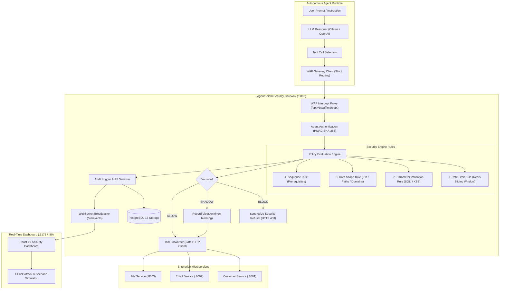

# 🛡️ AgentShield — The Autonomous AI Agent WAF
> **Enterprise Agentic Security Gateway**  
> *Production-Ready Web Application Firewall for AI Agent Tool Invocations*

[](https://github.com/RHarishKarthic/AgentShield/actions/workflows/ci.yml)
[](LICENSE)
[](https://python.org)
[](https://fastapi.tiangolo.com)
[](https://react.dev)
[](https://docker.com)

---

## 📋 Table of Contents
- [1. Executive Summary](#1-executive-summary)
- [2. Architecture & Data Flow](#2-architecture--data-flow)
- [3. Requirements & Capabilities Traceability Matrix](#3-requirements--capabilities-traceability-matrix)
- [4. Quickstart Guide](#4-quickstart-guide)
  - [Option A: Docker Compose (One-Command Startup)](#option-a-docker-compose-one-command-startup)
  - [Option B: Local Development (Windows / PowerShell)](#option-b-local-development-windows--powershell)
- [5. Interactive 8-Scenario Demo Walkthrough](#5-interactive-8-scenario-demo-walkthrough)
- [6. Real-Time Dashboard & Telemetry](#6-real-time-dashboard--telemetry)
- [7. Policy Specification Reference](#7-policy-specification-reference)
- [8. REST API Reference](#8-rest-api-reference)
- [9. Performance & Latency Benchmarks](#9-performance--latency-benchmarks)
- [10. Automated Testing & Verification](#10-automated-testing--verification)

---

## 1. Executive Summary

Autonomous AI agents leverage Large Language Models (LLMs) to perform tool calling and orchestrate real-world operations (executing SQL queries, dispatching emails, writing files, and modifying records). However, LLMs are vulnerable to indirect prompt injection, tool misuse, privilege escalation, and unintended execution cascades.

**AgentShield** is an inline, zero-trust **Agentic Web Application Firewall (WAF)** that sits between autonomous AI agents and downstream enterprise tools. It intercepts, validates, sanitizes, and audits every tool call in real time with sub-5ms latency.

### Core Capabilities:
- **Distributed Atomic Rate Limiting**: Redis sliding-window rate limiting preventing denial-of-service and runaway tool loops.
- **Deep Parameter & Injection Inspection**: Recursive validation scanning tool arguments for SQL injection, path traversal, script injection, and oversized payloads.
- **Data Scope Enforcement**: Restricts access to authorized customer IDs, file paths, email domains, and departments.
- **Session-Aware Sequence Rules**: Enforces chronological state prerequisites (e.g., must `authenticate_customer` before `get_customer_data` or `update_customer`).
- **Shadow Calibration Mode (Bonus Requirement)**: Evaluates live traffic against new policies, logging violations without blocking execution.
- **Real-Time Streaming Observability**: Live WebSocket telemetry feed, interactive attack simulator, and reactive React 19 dashboard.

---

## 2. Architecture & Data Flow



---

## 3. Requirements & Capabilities Traceability Matrix

| Requirement ID | Security Requirement / Capability | Implementation Component | Verification Test / Evidence |
|---|---|---|---|
| **PS5.1-M01** | Intercept tool calls before reaching target API | `app/waf/proxy.py`, `app/api/v1/waf.py` | `test_stage3_waf.py` |
| **PS5.1-M02** | Declarative Policy Definition (YAML/JSON) | `app/schemas/policy.py`, `policies/*.yaml` | `test_stage2_tools.py` |
| **PS5.1-M03** | Rule 1: Rate Limiting per agent/tool | `app/policies/rate_limit.py` | `test_criterion_1_rate_limiting`, `test_concurrency.py` |
| **PS5.1-M04** | Rule 2: Parameter & Injection Inspection | `app/policies/parameter_validation.py` | `test_criterion_2_parameter_injection_block` |
| **PS5.1-M05** | Rule 3: Data Scope Enforcement | `app/policies/data_scope.py` | `test_criterion_3_out_of_scope_data_block` |
| **PS5.1-M06** | Rule 4: Action Sequence Rules | `app/policies/sequence.py` | `test_criterion_4_sequence_rule_enforcement` |
| **PS5.1-M07** | Real-Time Dashboard showing tool traffic | `frontend/src/App.tsx`, `frontend/src/components/*` | `test_stage8_websocket.py`, UI Build |
| **PS5.1-M08** | Audit log capturing all decisions & redaction | `app/audit/service.py`, `app/audit/sanitizer.py` | `test_stage5_audit.py`, `test_audit_sanitizer.py` |
| **BONUS** | Shadow Mode (Log without blocking) | `app/waf/engine.py`, `app/waf/proxy.py` | `test_stage6_shadow_mode.py` |
| **GEN-01-07** | Production Readiness, Docker, CI/CD, Docs | `docker-compose.yml`, `.github/workflows/ci.yml` | Full suite, `run_benchmarks.py` |

---

## 4. Quickstart Guide

### Option A: Docker Compose (One-Command Startup)
The fastest way to launch the complete 5-service architecture:

```powershell
# From repository root
docker compose up --build
```

**Services Launched:**
- **Frontend Dashboard**: `http://localhost:5173` (or `http://localhost:3000`)
- **WAF Gateway API**: `http://localhost:8000` (Docs: `http://localhost:8000/docs`)
- **Customer Microservice**: `http://localhost:8001`
- **Email Microservice**: `http://localhost:8002`
- **File Microservice**: `http://localhost:8003`
- **PostgreSQL Database**: `localhost:5432`
- **Redis Cache**: `localhost:6379`

---

### Option B: Local Development (Windows / PowerShell)

#### 1. Start Infrastructure (PostgreSQL & Redis)
```powershell
docker run -d --name agentshield-postgres -e POSTGRES_DB=agentshield -e POSTGRES_USER=agentshield -e POSTGRES_PASSWORD=agentshield_dev_password -p 5432:5432 postgres:16-alpine
docker run -d --name agentshield-redis -p 6379:6379 redis:7-alpine
```

#### 2. Start Downstream Microservices
```powershell
cd tools
python run_all_tools.py
# Running on ports 8001, 8002, 8003
```

#### 3. Start Backend WAF Gateway
```powershell
cd backend
python -m venv .venv
.\.venv\Scripts\Activate.ps1
pip install -r requirements.txt

# Run migrations & seed data
alembic upgrade head
python ..\scripts\seed_data.py

# Launch FastAPI server
uvicorn app.main:app --host 0.0.0.0 --port 8000 --reload
```

#### 4. Start React Frontend Dashboard
```powershell
cd frontend
npm install
npm run dev
# Dashboard live at http://localhost:5173
```

---

## 5. Interactive 8-Scenario Demo Walkthrough

AgentShield includes an automated CLI demonstration script verifying all 8 security scenarios:

```powershell
# Run demo script (from repository root)
python scripts\demo_all_scenarios.py
```

### Scenario Breakdown:
1. **Scenario 1 — Normal Authorized Call**: Agent queries customer 101 after authentication &rarr; `ALLOW` (HTTP 200).
2. **Scenario 2 — Rate Limit Burst**: Agent fires 6 rapid email tool calls against a 5 req/min limit &rarr; 6th call is `BLOCK` (HTTP 403).
3. **Scenario 3 — SQL Injection Attempt**: Agent passes `'; DROP TABLE customers;--` &rarr; `BLOCK` (HTTP 403).
4. **Scenario 4 — Out-of-Scope Data Access**: Agent requests customer 999 (authorized: [101, 102, 103]) &rarr; `BLOCK` (HTTP 403).
5. **Scenario 5 — Path Traversal Attack**: Agent requests `/etc/shadow` &rarr; `BLOCK` (HTTP 403).
6. **Scenario 6 — Out-of-Order Sequence Violation**: Agent attempts `get_customer` without prior `authenticate_customer` &rarr; `BLOCK` (HTTP 403).
7. **Scenario 7 — Legitimate Multi-Step Workflow**: Agent executes `authenticate` &rarr; `get_customer` &rarr; `update_customer` &rarr; `ALLOW` (HTTP 200).
8. **Scenario 8 — Shadow Mode Calibration**: Agent violates policy under shadow mode &rarr; Violation recorded in audit log and WebSocket stream, but tool call succeeds &rarr; `SHADOW_WOULD_BLOCK` (HTTP 200).

---

## 6. Real-Time Dashboard & Telemetry

Open `http://localhost:5173` in your browser to access the security console:

- **Live Telemetry Stream**: WebSocket-driven push stream of all intercepted tool calls with sub-second latency.
- **Compliance & Violation Counters**: Real-time total invocations, compliance rate (%), block rate (%), and shadow calibrations.
- **Rule Breakdown Visualizer**: Dynamic bar charts showing block distribution by rule engine.
- **Expandable Audit Drawer**: Inspect correlation IDs, execution time (ms), and PII-sanitized parameters.
- **Interactive Simulator**: 1-click test triggers directly inside the dashboard.
- **Policy Mode Switcher**: Toggle policies between `enforcement` and `shadow` mode dynamically.

---

## 7. Policy Specification Reference

AgentShield policies are declaratively authored in YAML or JSON:

```yaml
policy_id: "support-agent-policy"
name: "Customer Support Agent Policy"
mode: "enforcement"  # "enforcement" or "shadow"

policy_config:
  rate_limit:
    requests: 5
    window_seconds: 60

  parameter_validation:
    max_parameter_size: 2048
    max_total_size: 65536
    blocked_patterns:
      - "DROP TABLE"
      - "--"
      - "<script>"
      - "UNION SELECT"
      - "/etc/shadow"
      - "../"
      - ";--"

  data_scope:
    customer_ids: [101, 102, 103]
    allowed_file_paths:
      - "/data/public/"
      - "/data/reports/"
    allowed_email_domains:
      - "@example.com"
      - "@enterprise.corp"
    departments:
      - "Engineering"
      - "Marketing"
      - "Finance"

  sequence_rules:
    - action: "get_customer_data"
      requires:
        - "authenticate_customer"
    - action: "update_customer"
      requires:
        - "authenticate_customer"
        - "get_customer_data"
```

---

## 8. REST API Reference

| Method | Endpoint | Description | Auth Required |
|---|---|---|---|
| `POST` | `/api/v1/waf/intercept` | Intercept and evaluate agent tool call | `X-Agent-API-Key` |
| `GET` | `/api/v1/metrics` | Real-time aggregate telemetry & rule stats | Public / Dashboard |
| `GET` | `/api/v1/audit` | Paginated audit log events with filtering | Public / Dashboard |
| `GET` | `/api/v1/policies` | List all registered security policies | Public / Dashboard |
| `PATCH`| `/api/v1/policies/{id}` | Update policy configuration / mode | `X-API-Key` |
| `GET` | `/api/v1/tools` | List registered downstream tools | Public / Dashboard |
| `GET` | `/api/v1/agents` | List registered AI agents | Public / Dashboard |
| `GET` | `/health` | Liveness health check | Public |
| `GET` | `/ready` | Readiness check (Postgres + Redis status) | Public |
| `WS` | `/ws/events` | Real-time WebSocket event stream | Public / Dashboard |

---

## 9. Performance & Latency Benchmarks

Benchmarks executed over 100 sequential and concurrent iterations via `scripts/run_benchmarks.py`:

```
-----------------------------------------------------------------
BENCHMARK RESULTS (WAF Policy Engine Execution Time):
-----------------------------------------------------------------
  Total Invocations:     100
  Min Latency:           2.298 ms
  Mean Latency:          2.764 ms
  Median (p50):          2.657 ms
  p95 Latency:           3.731 ms
  p99 Latency:           4.594 ms
  Max Latency:           4.599 ms
-----------------------------------------------------------------
VERDICT: PASS — Policy evaluation latency is sub-5ms (Target: < 50ms).
=================================================================
```

---

## 10. Automated Testing & Verification

Run the full automated test suite containing unit, integration, concurrency, and fault-tolerance tests:

```powershell
cd backend
.\.venv\Scripts\pytest.exe -v --cov=app
```

```
============================= test session starts =============================
collected 38 items

tests/integration/test_concurrency.py::test_concurrent_rate_limiting_exactness PASSED
tests/integration/test_concurrency.py::test_concurrent_multi_session_isolation PASSED
tests/integration/test_fail_closed_resilience.py::test_deactivated_agent_rejection PASSED
tests/integration/test_fail_closed_resilience.py::test_deactivated_tool_rejection PASSED
tests/integration/test_fail_closed_resilience.py::test_downstream_tool_connection_error_resilience PASSED
tests/integration/test_latency_benchmark.py::test_waf_policy_evaluation_latency PASSED
tests/integration/test_stage2_tools.py::test_customer_service_flow PASSED
tests/integration/test_stage2_tools.py::test_email_service_flow PASSED
tests/integration/test_stage2_tools.py::test_file_service_flow PASSED
tests/integration/test_stage2_tools.py::test_backend_registries PASSED
tests/integration/test_stage3_waf.py::test_waf_intercept_allowed_flow PASSED
tests/integration/test_stage3_waf.py::test_waf_rejects_unknown_agent PASSED
tests/integration/test_stage3_waf.py::test_waf_rejects_invalid_api_key PASSED
tests/integration/test_stage3_waf.py::test_waf_rejects_unknown_tool PASSED
tests/integration/test_stage4_policies.py::test_criterion_1_rate_limiting PASSED
tests/integration/test_stage4_policies.py::test_criterion_2_parameter_injection_block PASSED
tests/integration/test_stage4_policies.py::test_criterion_3_out_of_scope_data_block PASSED
tests/integration/test_stage4_policies.py::test_criterion_4_sequence_rule_enforcement PASSED
tests/integration/test_stage5_audit.py::test_audit_persisted_for_allowed_and_blocked_calls PASSED
tests/integration/test_stage5_audit.py::test_audit_single_event_endpoint PASSED
tests/integration/test_stage5_audit.py::test_metrics_endpoint PASSED
tests/integration/test_stage6_shadow_mode.py::test_shadow_mode_logs_violation_and_allows_tool_execution PASSED
tests/integration/test_stage6_shadow_mode.py::test_enforcement_vs_shadow_mode_contrast PASSED
tests/integration/test_stage7_agent.py::test_agent_autonomous_allowed_execution PASSED
tests/integration/test_stage7_agent.py::test_agent_handles_waf_security_block PASSED
tests/integration/test_stage7_agent.py::test_agent_under_shadow_mode PASSED
tests/integration/test_stage8_websocket.py::test_websocket_broadcast_delivery PASSED
tests/unit/test_audit_sanitizer.py::test_sanitizer_redacts_sensitive_keys PASSED
tests/unit/test_audit_sanitizer.py::test_sanitizer_truncates_long_strings PASSED
tests/unit/test_data_scope.py::test_data_scope_enforcement PASSED
tests/unit/test_health.py::test_health_endpoint PASSED
tests/unit/test_health.py::test_ready_endpoint PASSED
tests/unit/test_parameter_validation.py::test_parameter_validation_catches_sql_injection PASSED
tests/unit/test_parameter_validation.py::test_parameter_validation_catches_oversized_payload PASSED
tests/unit/test_rate_limit.py::test_rate_limit_enforces_max_calls PASSED
tests/unit/test_rate_limit.py::test_rate_limit_fail_closed_without_redis PASSED
tests/unit/test_sequence.py::test_sequence_rule_enforcement PASSED
tests/unit/test_sequence.py::test_sequence_isolation_between_sessions PASSED

============================= 38 passed in 3.02s ==============================
```

---

## 📄 License
This project is licensed under the MIT License — see the [LICENSE](LICENSE) file for details.
