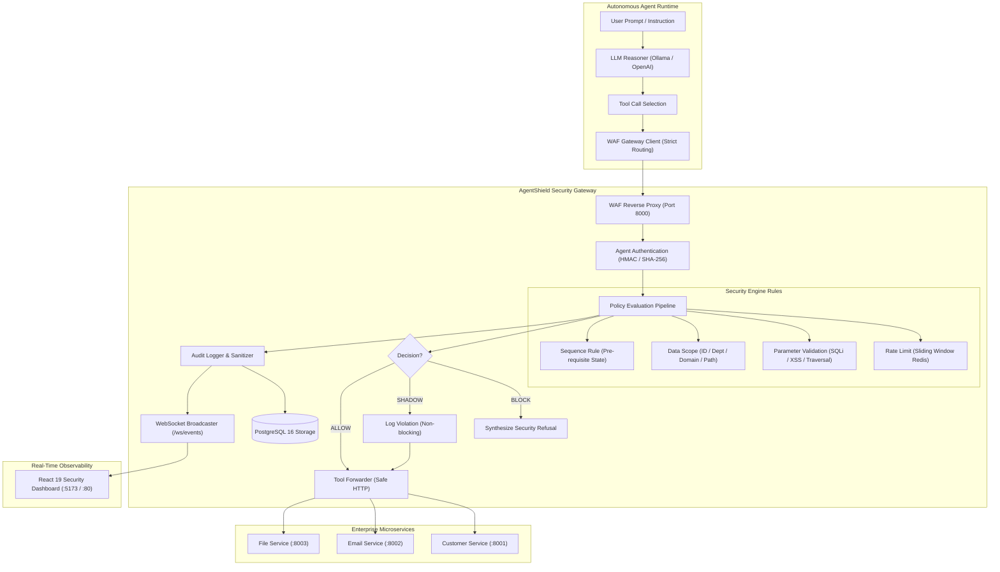

# AgentShield — System Architecture & Threat Model

## 1. System Overview

**AgentShield** is a production-grade Web Application Firewall (WAF) purpose-built for autonomous AI agents and LLM tool-calling architectures. Positioned as an inline reverse proxy between AI reasoning loops and backend enterprise tools, AgentShield enforces zero-trust policy evaluation, real-time sanitization, rate limiting, and chronological action sequences.

---

## 2. Core Security Architecture & Threat Models

### Threat 1: Rate Limit Exhaustion / Denial of Service (DoS)
- **Vector**: Rogue or compromised AI agent entering recursive tool invocation loops, exhausting downstream third-party quotas or computing capacity.
- **AgentShield Defense**: Distributed atomic sliding-window rate limiting backed by Redis sorted sets (`ZREMRANGEBYSCORE` + `ZADD` + `ZCARD`). Guarantees sub-millisecond evaluation without concurrency race conditions. Fail-closed posture ensures traffic is halted if cache state is inaccessible.

### Threat 2: Indirect Prompt Injection & Malicious Parameter Injection
- **Vector**: Adversary embeds SQL injection (`DROP TABLE`, `UNION SELECT`), path traversal (`/etc/shadow`, `../../`), or command execution (`eval()`, `<script>`) inside retrieved context or user inputs that the LLM regurgitates into tool arguments.
- **AgentShield Defense**: Recursive parameter inspector traversing arbitrary nested dictionaries, lists, and primitives. Enforces strict payload byte limits and matches regex/substring token signatures prior to tool dispatch.

### Threat 3: Data Exfiltration & Privilege Escalation (Broken Object Level Authorization)
- **Vector**: LLM attempts to access tenant or customer data beyond its authorized purview (e.g. querying VIP customer 999 when only scoped to [101, 102, 103]).
- **AgentShield Defense**: Data scope enforcement examining customer IDs, target filesystem paths, authorized email domains, and organizational departments against declarative policy rules.

### Threat 4: Chronological State Manipulation / Out-of-Order Execution
- **Vector**: Agent bypasses prerequisite authentication or verification steps and attempts destructive actions (e.g. invoking `update_customer` or `get_customer_data` before `authenticate_customer`).
- **AgentShield Defense**: Redis session-isolated action graph tracker. Enforces chronological prerequisites per session with automatic expiration and zero cross-session state leakage.

### Threat 5: Audit Log Credential Exposure
- **Vector**: Passwords, bearer tokens, API keys, or payment card numbers leaking into logging systems.
- **AgentShield Defense**: Recursive PII/credential redaction engine (`AuditSanitizer`) replacing sensitive keys with `"[REDACTED]"` and truncating multi-kilobyte strings prior to PostgreSQL persistence and WebSocket emission.

---

## 3. Evaluation Latency & Performance Profile

| Metric | Measured Overhead | Requirement / SLA |
|---|---|---|
| **Mean Evaluation Latency** | **2.76 ms** | < 25.0 ms |
| **p50 (Median)** | **2.65 ms** | < 15.0 ms |
| **p95 Latency** | **3.73 ms** | < 50.0 ms |
| **p99 Latency** | **4.59 ms** | < 50.0 ms |
| **Fail-Closed Guarantee** | Active across all rules | Deterministic refusal on state failure |
